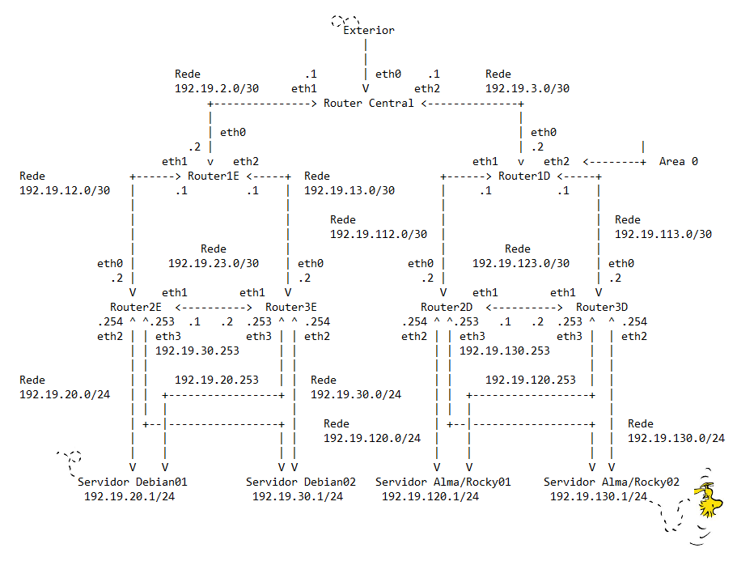

*Ler em [Inglês](README.md)*

# Simulação de Rede Empresarial: VyOS, OSPF, GRE/IPsec e VRRP

Este repositório contém a documentação, configurações e scripts de automação do meu Projeto Final da UFCD 5104 (Instalação de Redes Locais), desenvolvido durante o Curso Técnico Especialista em Gestão de Redes e Sistemas Informáticos (CET) no IEFP Alcântara, Lisboa.

## 📌 Topologia da Rede

## 🎯 Objetivos e Tecnologias Implementadas
O projeto consistiu na criação de uma rede empresarial simulada no VirtualBox, garantindo alta disponibilidade, routing dinâmico e comunicações seguras entre diferentes *sites*. Foram aplicadas as seguintes tecnologias:

* **Routing Dinâmico (OSPF Multi-área):** Configuração de OSPF distribuído pelas Áreas 0, 1 e 2.
* **Segurança e Túneis (GRE sobre IPsec):** Implementação de VPN Site-to-Site para interligação segura entre escritórios.
* **Alta Disponibilidade (VRRP):** Redundância de *gateways* para garantir *failover* automático caso um dos routers principais falhe.
* **Serviços de Borda (NAT):** Mascaramento de IP no Router Central para acesso ao exterior.
* **Sistemas Operativos Utilizados:** VyOS (Routers virtuais), Debian e AlmaLinux (Servidores finais).

## 📂 Estrutura do Repositório
* `/configs/` - Configurações completas (`.conf`) extraídas dos 7 Routers VyOS.
* `/docs/` - Relatório técnico detalhado com testes de conectividade e failover (Ping, SSH e quebras de estado VRRP).
* `/img/` - Esquema e diagrama da rede.
* `/scripts/` - Scripts `.bat` para automação (arranque e *save state*) de todas as VMs no VirtualBox em simultâneo.

## 🚀 Como Executar
1. Importar as VMs de VyOS e Linux para o Oracle VirtualBox.
2. Garantir que os nomes das VMs coincidem exatamente com as variáveis definidas na pasta `/scripts/`.
3. Executar o script `StartVMs.bat` para arrancar todas as máquinas com *delay* configurado para evitar sobrecarga de CPU.